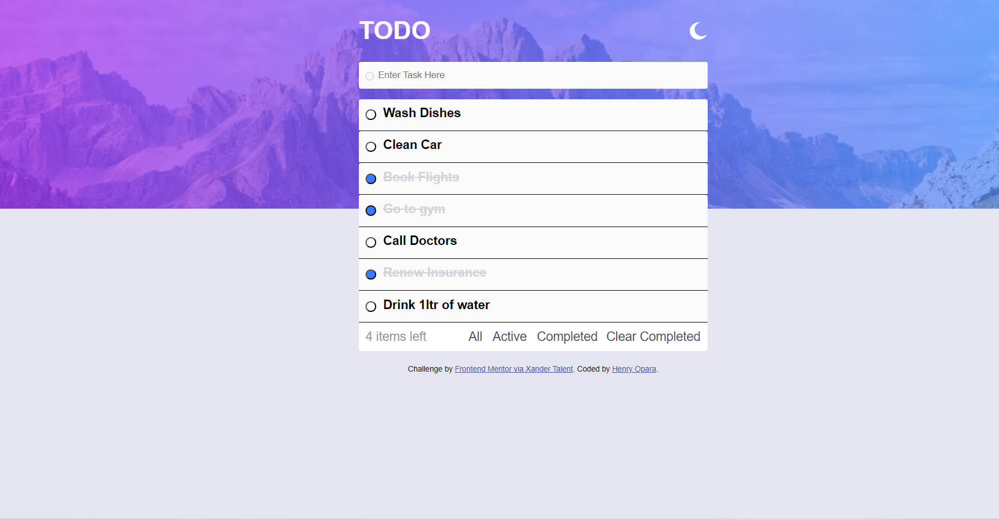
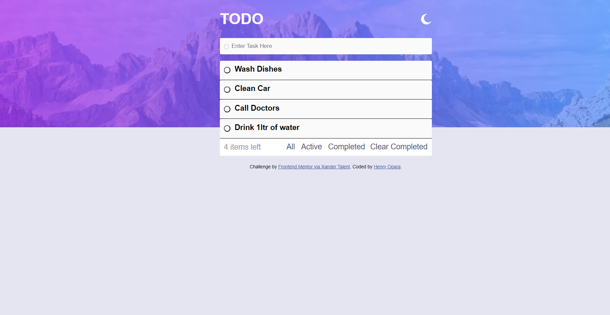
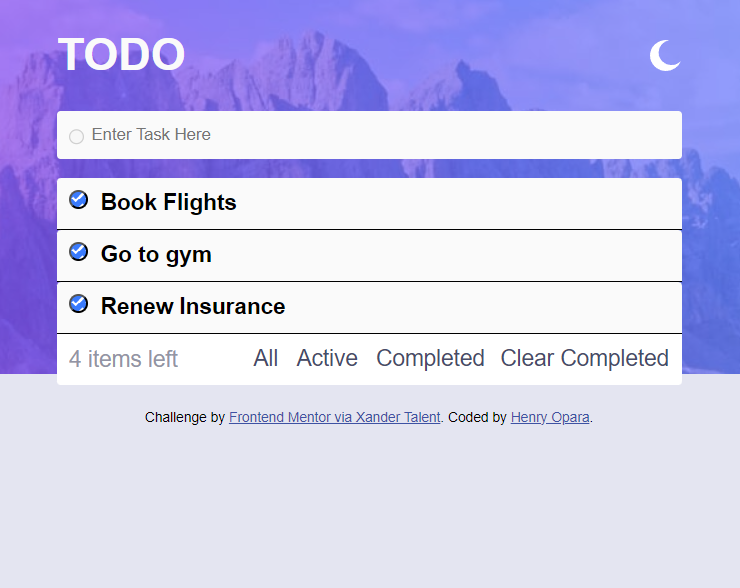

# Todo App Solution

This was a solution to the [Todo app challenge on Frontend Mentor](https://www.frontendmentor.io/challenges/todo-app-Su1_KokOW). This Frontend Mentor challenge helped me to improve my coding skills by building a realistic task recording project. 

## Table of contents

- [Overview](#overview)
  - [The challenge](#the-challenge)
  - [Screenshot](#screenshot)
- [My process](#my-process)
  - [Built with](#built-with)
  - [What I learned](#what-i-learned)
  - [Continued development](#continued-development)
  - [Useful resources](#useful-resources)
- [Author](#author)
- [Acknowledgments](#acknowledgments)

**Note: Delete this note and update the table of contents based on what sections you keep.**

## Overview

### The challenge

Users should be able to:

- View the optimal layout for the app depending on their device's screen size
- See hover states for all interactive elements on the page
- Add new todos to the list
- Mark todos as complete
- Delete todos from the list
- Filter by all/active/complete todos
- Clear all completed todos
- Toggle light and dark mode
- **Bonus**: Drag and drop to reorder items on the list

### Screenshot

## My process

### Built with

- Semantic HTML5 markup
- CSS custom properties
- Flexbox
- CSS Grid
- Mobile-first workflow
- Javascript 

### What I learned

The most important lessons for me during the project was to learn how to inject HTML elements into the DOM. 

This example code below was the way I choose to inject my HTML on this project:

//filter only active tasks
let act = document.getElementById('act')

act.addEventListener('click', function(){

    const actList = dataAct.map((act) => {

        const { id, task } = act;

        return `
        

            <button class="comp-btn-blue" type="button" id="${id + '-comp'}" onclick="getClickID(this.id)"></button>
            ${task}
            <button class="clr-btn" type="button" id="${id + '-clr'}" onclick="getID(this.id)">&times;</button>
        

        `;    

        }).join("");
    
    tasksContainerCom.innerHTML = ''
    tasksContainer.innerHTML = ''
    tasksContainerAct.innerHTML = actList;

})

However, I also discovered other ways to do this with the example code below:

//Add task to list
function addDiv(num, task) {

        let newcard = document.createElement('div')
        let newElementRadio = document.createElement('input')
        let newElementInput = document.createElement('span')
        let newElementcross = document.createElement('button')
    
        tasksContainer.appendChild(newcard).classList.add('task-card')
        newcard.appendChild(newElementRadio).setAttribute('type', 'radio')
        newcard.appendChild(newElementInput).textContent = task
        newcard.appendChild(newElementcross).setAttribute('class', 'bt')

        for(let i = 0; i < data.length; i++) {

            tasksContainer.lastChild.setAttribute('id', num)
    
        }
    
}

### Continued development

I would like to learn more about using frameworks for CSS like SASS, this would have helped me structure my CSS code better and mode toggling between light and dark more easier to set up.

### Useful resources

- [MDN]([https://www.example.com](https://developer.mozilla.org/en-US/docs/Learn)) - This helped me with code structure and syntax.
- [W3Schools]([https://www.example.com](https://www.w3schools.com/)) - This is helped me write functions for onclick events to get IDs of elements in the DOM.

## Author

- Linkedin - [Henry Opara](https://www.linkedin.com/in/henry-c-56323720b/)

## Acknowledgments

Thank you to Xander Talent for pushing me to challenge myself with this project and the additional resources they provided to help me learn Vanilla JavaScript.
